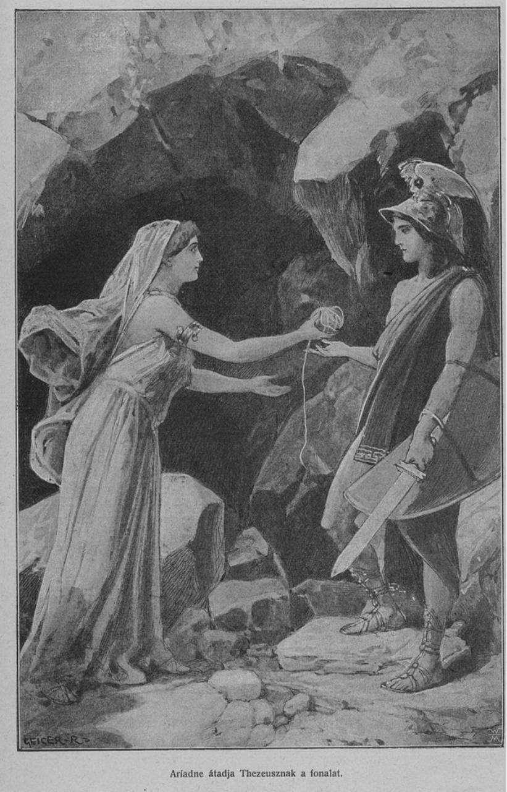

# AriaTrace

AriaTrace is PC-hosted, vision-guided gameplay replay for an unrooted Android device. A human demonstration defines the route, observable stages, and action priors. A later live run aligns itself to that demonstration and changes controls from visual feedback to overcome cross-session variance.

The name joins Ariadne's guiding thread, an aria interpreted as a live performance, and the recorded trace that connects both sessions. See [PROJECT_DEFINITION.md](PROJECT_DEFINITION.md) for the complete purpose and story.

## Ariadne's thread



*Ariadne gives Theseus the thread before he enters the Labyrinth.*

In Greek mythology, Ariadne gave Theseus a ball of thread before he entered the Labyrinth to confront the Minotaur. Theseus secured one end at the entrance and unwound the thread as he travelled through the maze. After the confrontation, the path he had laid down guided him out again.

That is the central metaphor for AriaTrace. A human demonstration lays down a perceptual thread: route observations, landmarks, actions, timing, and uncertainty remain connected as evidence. During a later run, AriaTrace does not blindly repeat a timed sequence. It watches the current scene, finds where it is relative to the recorded trace, and adjusts its actions to keep following that thread toward the destination.

The **aria** in the name emphasizes that every run is a new performance rather than an identical playback. The **trace** is both the route left by the demonstration and the inspectable evidence connecting what was seen, what was done, and why the replay chose its next action.

This is not timed macro playback. Reliable route completion is the objective; localization is one supporting signal.

Genshin Impact PC is the first POC game. The Acquisition Workbench records an unrestricted number of sessions, then lets the operator classify each one from a short label list: ordinary cruise, rotation-only, slow horizontal 360° scene turn, movement-only, straight-forward/no-turn, full-map coverage, or route demonstration. The workbench calibrates the circular mini-map and scene-relative yaw, verifies pose and shift evidence, stitches the observed map, and can run a two-rate live tracker using low-rate absolute map fixes plus high-rate relative shift and rotation. It persists selected-source provenance, quality metrics, and task-specific visual evidence for review.

Start the integrated PC acquisition flow from the repository root:

    $env:PYTHONPATH=((Resolve-Path .tools).Path + ';' + (Resolve-Path .).Path)
    python -m aria_trace.apps.workbench

Open http://127.0.0.1:8765/. Choose the game, visible game window, input type, and duration, then select **Start recording**. Switch to the game during the three-second settling countdown; recording begins on the first control received while that game has focus and stops after the selected duration. The optional overlay hides whenever the game loses focus and can be shown or hidden from the Workbench. Every successful, non-empty session appears in the list, where it can be labeled or moved to recoverable trash. Failed, canceled, zero-duration, and frameless attempts are discarded automatically.

The process that starts the Workbench owns its lifecycle. Its instance ID, PID, endpoint, start time, and data roots are exposed by `/api/instance`, with the essential identity also shown in the page header. A second launch on the same port reports the existing instance and exits without replacing it; stop the owner explicitly with Ctrl+C before restarting.

Camera-to-phone rig calibration has a separate Windows desktop application:

    python -m aria_trace.apps.rig_calibrator

Its USB camera, phone target, and optional ADB access are operator initiated and
do not touch recorder sessions. See
[the app guide](aria_trace/apps/rig_calibrator/README.md) for the guided
geometry, exact-pixel focus, standardized e-SFR/MTF design, established feature
matching measurements, latency, YAML, adapter, and isolated PyInstaller build
workflows. The current source replaces the former project-defined resolving
power screen with display-referred e-SFR/MTF and ground-truth feature matching.
It reports its primary e-SFR/MTF result in cycles per display
pixel; cycles per camera pixel is retained only as the native analysis axis,
while physical cycles/mm is optional and requires measured display pitch. A
one-pixel alternating phone pattern is `0.5 cycles/display-pixel`, not an
unqualified `1 line/pixel` result.

## Task-oriented `aria_tools` calibration workflows

Run these commands from the repository root in a user-managed Python
environment. `ARIA_PROFILE_ROOT` is the shared registry and calibration root;
when it is unset, AriaTrace uses `profiles/` under the current directory.

```powershell
$env:ARIA_PROFILE_ROOT = "E:\aria-profiles"
python -m aria_tools setup configure `
  --camera-id CAMERA_SERIAL `
  --phone-id ADB_SERIAL `
  --game-id GAME_ID `
  --rig-repeatability relaxed
python -m aria_tools setup show
```

`phone` in a profile name means an Android/panel platform, not one handset.
Phone serial and model are provenance. Panel dimensions, game identity, and
game layout determine portability. An explicit incompatible import is allowed
and records warnings; automatic camera opening never silently substitutes an
unrelated rig calibration.

### 1. Setup from scratch

First position and focus the camera and phone, then run interactive rig
calibration. The GUI shows the full ChArUco target and waits for the operator
before collecting geometry. A successful save publishes the active local
`rig` profile.

```powershell
python -m aria_tools rig-calibration
```

Rig calibration uses the bundled native immersive Android target by default:
it draws full-bleed into a `SurfaceView`, hides system bars, keeps the panel on,
and acknowledges each painted target over ADB reverse. Browser and Gallery
presenters are compatibility options only. At open, app-raster mismatch and
physical-DPI anisotropy are saved as warnings rather than gates. Panel scale is
derived from HIK ChArUco board metric plus the native surface extent by default
on MTK devices (`--panel-scale auto`); `adb` and `hik_charuco` are explicit
overrides.

The signed presenter APK is versioned with its source at
`android/phone-target/aria-phone-target.apk`; no separate download is required.
Rig calibration automatically resolves and installs it when the package is
absent, then reuses the installed compatible app. Maintainers can rebuild the
checked-in binary after changing the Activity:

```powershell
.\android\phone-target\build-phone-target.bat `
  -Output .\android\phone-target\aria-phone-target.apk
```

Use `--phone-target-apk PATH` for one calibration run, or set
`ARIA_PHONE_TARGET_APK` for a persistent explicit override. Standalone releases
place the same APK at `phone-target/aria-phone-target.apk`. The presenter uses
ADB only for installation, launch, reverse-port setup, and acknowledgements;
ADB itself remains a user-managed dependency.

Prepare the game at a stable playable scene. Capture settled ADB images and
matching rig-normalized HIK images for mini-map discovery and color fitting:

```powershell
python -m aria_tools zigzag-acquisition `
  --game-id GAME_ID `
  --android-capture adb-screenshot `
  --require-hik
```

Every diagonal stroke defaults to 20% of the landscape display height on both
axes (216 px horizontally and vertically on a 2400x1080 game raster).
Override either distance independently with
`--horizontal-swipe-distance-px PX` or `--vertical-swipe-distance-px PX`.

This settled-screenshot mode locates neither scrcpy nor external FFmpeg. It
stores the ADB stream only as lossless PNG images; it never creates an ADB
video. An optional synchronized HIK stream remains an MJPEG video because it
does not load the phone. Continuous `--android-capture scrcpy` still requires
scrcpy and FFmpeg for its H.264 stream. Each PNG path is attached to its
`frames.jsonl` record, where `metadata.image_space` remains the authoritative
spatial contract.

The command prints the resulting `SESSION` directory. It waits for operator
confirmation before touching the game. `--require-hik` prevents an unnoticed
ADB-only fallback because color fitting requires both sources.

For the normal task-oriented path, give that immutable session to one command:

```powershell
python -m aria_tools game-calibration SESSION --game-id GAME_ID
```

`game-calibration` inspects the data instead of requiring every calibration.
It independently attempts game-screen upright orientation, automatic mini-map
boundary discovery, and HIK game color. Missing HIK frames, missing movement,
or insufficient visual features are reported as structured skips in
`game_calibration_summary.json`; successful capabilities are still published.
Movement is not required. Use `--candidate` to write evidence and immutable
review revisions without activating them.

Screen orientation is a rig-game capability distinct from Android settings and
from game-world north. It aggregates up to 12 synchronized ADB/HIK pairs,
rejects sparse/full threshold masks and low-edge images, and stores lossless
source stills plus candidate evidence. Rectified runtime precomposes that
quarter-turn into the existing lookup map, so each frame still uses one remap;
only an explicitly unrectified stream uses a discrete no-interpolation rotation,
and every rotated frame retains its parent image-space
metadata.

Publish the reviewed mini-map localization result and compose it with the
active local rig:

```powershell
python -m aria_tools profiles publish-minimap `
  LOCALIZATION_SUMMARY_OR_DIRECTORY `
  --activate
```

`publish-minimap` imports an already-produced localization or calibration
result. To calibrate a standard acquisition session directly, use the command
below. It runs the verified boundary-plus-cursor backend from human-reviewed
rotation/movement intervals and accepts either a traceable PNG image series or
a video stream.

```powershell
python -m aria_tools minimap-calibration `
  STANDARD_SESSION `
  --rotation ROTATION_START ROTATION_END `
  --movement MOVEMENT_START MOVEMENT_END
```

The evidence directory is selected automatically below the effective
`ARIA_PROFILE_ROOT`, and successful results publish and activate the matching
`phone_game` plus optional `rig_game` revisions. Add an explicit output path
only for diagnostics, or `--candidate` to retain review evidence without
activation.

Fit game contrast/color from the synchronized zigzag session. This publishes
a portable ADB-side `phone_game_color` reference and a local, rig-specific
`rig_game_color` containing the HIK gamma/CCM result.

```powershell
python -m aria_tools game-color-calibration `
  SESSION `
  --game-id GAME_ID
```

The source session remains explicit immutable provenance. Evidence output,
game fallback, active rig selection, publication, and activation use the
effective profile registry automatically. An explicit output remains a
diagnostic override.

Verify selection, then open the dual-stream GUI:

```powershell
python -m aria_tools profiles resolve `
  --game-id GAME_ID --mode dual --color-policy game_matched
python -m aria_tools camera-adapter-demo `
  --game-id GAME_ID --mode dual --color-policy game_matched --gui
```

### 2. Production use after possible rig repositioning

Run this before starting gameplay on a fully calibrated system:

```powershell
python -m aria_tools rig-calibration `
  --reuse-if-unchanged `
  --headless `
  --save
```

The command resets HIK acquisition to the full sensor and compares detected
ChArUco corners with the active rig's saved projection. It ignores lighting,
color, and pixel-intensity changes. It skips full calibration when the rig is
unchanged; otherwise the same command
performs and publishes a fresh headless rig calibration. It never scans for a
newer artifact outside the registry. Because calibration presents ChArUco on
the phone, launch or restore the game only after this command finishes.

Once the game is prepared, an integrator can call the standalone repeatability
check without launching the app, sending input, changing display settings, or
running rig calibration:

```powershell
python -m aria_tools game-repeatability --game-id GAME_ID
# Equivalent human-friendly launcher:
.\game-repeatability-check.bat --game-id GAME_ID
```

The command prints JSON and writes `result.json` plus review images under the
reported output directory. It reports the foreground package, Android rotation
settings, current surface rotation, image-selected HIK quarter-turn, and a
geometry verdict. Production geometry uses only the static mini-map boundary
isolated by the active `phone_game` calibration; animated scene pixels and
color are excluded. The HIK check applies the selected quarter-turn to its
verification stream through `CalibratedHikFrameSource.set_output_orientation`
without changing rig geometry. Exit code `0` means match; `2` means mismatch
or unavailable.

For test apps without a mini-map profile, capture a baseline and then compare
the same app using the explicitly diagnostic whole-screen mode:

```powershell
python -m aria_tools game-repeatability --adb-only `
  --create-diagnostic-reference --output REFERENCE_DIRECTORY
python -m aria_tools game-repeatability --adb-only `
  --diagnostic-reference-result REFERENCE_DIRECTORY
```

This mode compares fixed-threshold app features and requires the prior result's
captured image-space metadata. It is not a substitute for a production
mini-map profile.

For a review-only rig test, capture the standardized three-space evidence
without running any geometry gate:

```powershell
.\rig-evidence-review.bat
# Or:
python -m aria_tools rig-evidence-review
```

The script does not launch an app, send input, change display power, or run
calibration. It saves the native ADB view, complete camera sensor view,
rig-rectified view, an expanded full-camera canvas, and one labeled comparison.
Green outlines identify the phone display/view, yellow identifies the complete
camera sensor, and magenta checkerboard is synthetic space outside captured
pixels. Every source and derived canvas is accompanied by its explicit space
metadata in `result.json`.

### 3. New game or new panel platform

For a new game on the same panel, update the game default and keep the existing
rig. For a new panel geometry, update the phone default and run rig calibration
before game capture because the panel coordinate system changed.

```powershell
python -m aria_tools setup configure --phone-id ADB_SERIAL --game-id NEW_GAME_ID
# Required for a different panel geometry; unnecessary for only a new game:
python -m aria_tools rig-calibration
```

Then repeat the game-specific part of setup from scratch: zigzag acquisition,
mini-map localization publication, and game-color calibration. Export the two
portable, camera-independent revisions after review:

```powershell
python -m aria_tools profiles list --kind phone_game --active-only
python -m aria_tools profiles export-portable PHONE_GAME_REVISION game-minimap.zip
python -m aria_tools profiles list --kind phone_game_color --active-only
python -m aria_tools profiles export-portable PHONE_GAME_COLOR_REVISION game-color.zip
```

Do not export `rig_game` or `rig_game_color` as portable data: they contain
local rig composition or HIK-specific photometric controls.

Publishing a new accepted rig calibration automatically recomposes every
compatible active `phone_game` revision into a new active `rig_game` revision.
This is the normal recovery path after the phone or camera is repositioned:
the saved phone/game boundary and rotation center are reused in canonical panel
space, while the new rig supplies all camera geometry. No game images are
replayed and no game-specific optical transform is fitted during recomposition.

### 4. New rig for a calibrated platform/game

Configure and calibrate the new camera/phone rig first:

```powershell
python -m aria_tools setup configure `
  --camera-id NEW_CAMERA_SERIAL `
  --phone-id ADB_SERIAL `
  --game-id GAME_ID
python -m aria_tools rig-calibration
```

Import the portable mini-map profile. Import is review-first by default;
`--activate` explicitly activates the imported `phone_game` and the newly
composed local `rig_game` that references this rig calibration.

```powershell
python -m aria_tools profiles import-portable game-minimap.zip `
  --game-id GAME_ID `
  --activate
python -m aria_tools profiles import-portable game-color.zip `
  --game-id GAME_ID
```

The portable color package supplies only the ADB target. It never applies a
different rig's HIK gamma/CCM. Capture one fresh synchronized zigzag session on
the new rig and run `game-color-calibration` to create its local
`rig_game_color`, then verify with `profiles resolve` and
`camera-adapter-demo` as shown above.

### 5. Switch phones on a calibrated rig/game

If the replacement phone has the same panel dimensions and game layout, the
existing `phone_game` profiles remain compatible; the changed serial is only
provenance. Preserve a portable copy of the active mini-map revision, update
the configured serial, and let the rig precheck decide whether the physical
swap changed camera geometry:

```powershell
python -m aria_tools profiles list --kind phone_game --active-only
python -m aria_tools profiles export-portable PHONE_GAME_REVISION phone-game.zip
python -m aria_tools setup configure --phone-id NEW_ADB_SERIAL --game-id GAME_ID
python -m aria_tools rig-calibration --reuse-if-unchanged --headless --save
python -m aria_tools profiles import-portable phone-game.zip `
  --phone-id NEW_ADB_SERIAL `
  --game-id GAME_ID `
  --activate
```

Re-importing composes the portable phone/game geometry with the active rig
revision; it does not rediscover the mini-map. If the rig calibration changed,
capture fresh synchronized ADB/HIK images and rerun game-color calibration.
If the replacement panel dimensions differ, follow **New game or new panel
platform** instead and perform new panel/game calibration.

## HIK camera adapter and demo stream

The production adapter uses the active profile registry; it does not scan
`artifacts/` or select an arbitrary calibration path. Configure
`ARIA_PROFILE_ROOT` and the camera/phone/game defaults first, then use the
HIK-shaped `hikcam` interface:

```python
import hikcam

with hikcam.HikCamera(config={
    "game_id": "genshin-impact",
    "mode": "dual",             # full, minimap, or dual
    "rectify": True,
    "color_order": "BGR",
    "color_policy": "game_matched",
}) as camera:
    frames = camera.get_frames()
    phone = frames["full"]
    minimap = frames["minimap"]

    # Proprietary additive API; ordinary HIK/OpenCV-style frame returns stay
    # image-only. Keep this metadata with every stored or transformed image.
    phone_space = camera.get_aria_frame_metadata("full")
    minimap_space = camera.get_aria_frame_metadata("minimap")
```

For a single stream, call `camera.get_frame()` or `camera.read()`, then call
`camera.get_aria_frame_metadata()` for the matching space, hardware ROI,
orientation, transform provenance, stored size, and color order. Do not infer a
HIK image's coordinate space from its dimensions or filename.

AriaTrace's own rig calibration, tests, and POCs use the atomic
`FrameSample`/`read_sample()` form so pixels cannot be separated from that
metadata. Persisted raw images retain the producer's space record. Human review
images use an expanded magenta-checker canvas: yellow outlines the complete
camera sensor and green outlines the projected phone display, including regions
outside the acquired ROI. The media registry stores the exact placements; an
early failure before geometry is known is labeled as projection unavailable.
See [the HIK rig calibration documentation](aria_trace/services/calibration/rig/hik/README.md#spatially-traceable-evidence).

Spatial metadata also stays attached to geometry. Mini-map circles, cursor
rotation centers, vectors, masks, polygons, and evidence quadrilaterals carry
their own `geometry_type`, spatial schema version, and raster `space`. Internal
consumers reject missing or incompatible spaces and require an explicit
transform before combining shapes. Older profiles are normalized only at a
named compatibility boundary where the containing crop/display contract proves
their legacy coordinate space; new results are always written space-aware.

| Mode | Rectified output | `rectify=False` / `--no-rectify` |
|---|---|---|
| `full` | rig-normalized phone display | hardware-ROI camera raster |
| `minimap` | phone/game-normalized mini-map | native camera mini-map ROI |
| `dual` | synchronized normalized phone + mini-map | synchronized native rig ROI + mini-map ROI |

`dual` derives both products from one HIK acquisition. Profile resolution and
camera configuration happen when the adapter opens; there are no registry
lookups per frame. The adapter locks calibrated exposure, gain, white balance,
ROI, and selected HIK gamma/color controls for the session. The adapter itself
does not wake, sleep, launch, unlock, or touch the phone.

Run a live GUI stream from the repository root:

```powershell
# Rig-normalized full phone view; requires an active rig profile.
python -m aria_tools camera-adapter-demo `
  --mode full --gui

# Synchronized normalized full + mini-map views; requires active rig-game data.
python -m aria_tools camera-adapter-demo `
  --game-id GAME_ID `
  --mode dual `
  --color-policy game_matched `
  --gui

# Lowest geometric-processing latency. Output remains explicitly space-tagged.
python -m aria_tools camera-adapter-demo `
  --game-id GAME_ID --mode dual --no-rectify --gui
```

To compare the calibrated adapter with the native camera path, run the same GUI
loop against Hikrobot's installed MVS Python SDK (`MvCameraControl_class`). Native
mode uses the existing full-sensor MVS acquisition source; it does not load rig or
game profiles, normalize geometry, rectify images, or operate the phone:

```powershell
python -m aria_tools camera-adapter-demo `
  --camera-library native --camera-id CAMERA_ID --gui
```

Native MVS verification supports the full-sensor stream only. Hikrobot MVS,
including `MvCameraControl_class.py` and its runtime DLLs, remains a user-managed
system dependency. Use `--mvs-python-path` when automatic MVS discovery is not
sufficient.

Press `Q` or `Esc`, or close either window, to stop. Add
`--manage-phone-display` only when the demo should best-effort wake the
calibrated phone at startup and sleep it on exit; this option only manages
display power and requires `--gui`.

From the standalone Windows release, the equivalent commands are:

```bat
camera-adapter-demo.bat --mode full
camera-adapter-demo.bat --game-id GAME_ID --mode dual --color-policy game_matched
camera-adapter-demo.bat --camera-library native --camera-id CAMERA_ID
python-tools.bat camera-adapter-demo --game-id GAME_ID --mode dual --gui
```

The release `camera-adapter-demo.bat` supplies `--gui` automatically. Its
Python dependencies must be installed with `install-camera-adapter.bat`; HIK
MVS remains a user-managed system dependency.

For the Genshin POC, record each useful motion as its own session. After **CAPTURE COMPLETE**, return to the list and choose the matching label. Selecting a label is the single review action that promotes a successful recording to usable evidence. The machine-readable index at `artifacts/workbench/poc_evidence/genshin-impact-pc/evidence_index.json` links those labels to source sessions, confirmation markers, timing/count summaries, and profile provenance.

Start with:

- [PROJECT_DEFINITION.md](PROJECT_DEFINITION.md) — concise scope and meaning of gameplay replay
- [PROJECT_CONSTITUTION.md](PROJECT_CONSTITUTION.md) — first principles and governing engineering rules
- [PROJECT_STATUS.md](PROJECT_STATUS.md) — tested state, commands, results, limitations, and next work
- [SRS.md](SRS.md) — brief requirements
- [SDS.md](SDS.md) — brief architecture and replaceable interfaces
- [RIG_CALIBRATION.md](RIG_CALIBRATION.md) — USB-camera/phone geometry, focus, matchability, UI, and YAML contract
- [SPATIAL_UNIFICATION.md](SPATIAL_UNIFICATION.md) — coordinate-frame graph for screens, cameras, mini-maps, maps, datasets, and time
- [docs/architecture/CURRENT_ARCHITECTURE.md](docs/architecture/CURRENT_ARCHITECTURE.md) — implemented package ownership and data flow
- [docs/architecture/COMPATIBILITY.md](docs/architecture/COMPATIBILITY.md) — retained legacy facades and removal rules
- [RECORDER_GUIDE.md](RECORDER_GUIDE.md) — minimal GUI workflow for recording repeated routes
- [poc/README.md](poc/README.md) — pose-estimation POC commands
- [poc/RESULTS.md](poc/RESULTS.md) — measured results

The normal recorder workflow is documented in [RECORDER_GUIDE.md](RECORDER_GUIDE.md). Detailed session format, diagnostic CLI, inspection, and review information is in [acquisition/README.md](acquisition/README.md).

Generated datasets, models, and plots are under ignored `data/` and `artifacts/` directories. Local tools and Python packages are under ignored `.tools/`.
