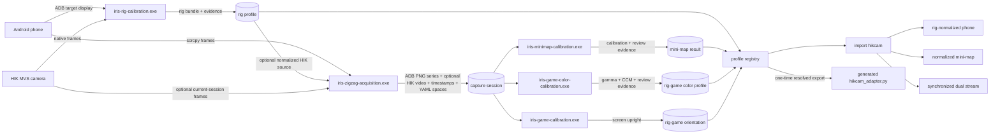
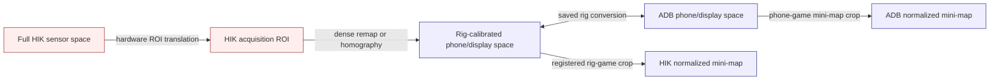
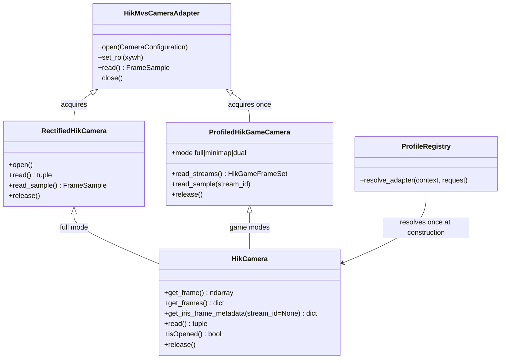
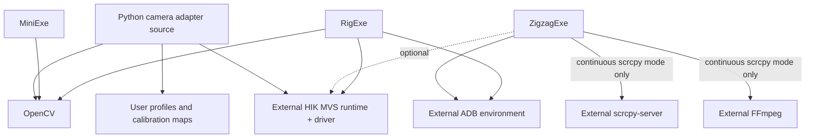

# Pipeline and architecture

The diagrams use [Mermaid](https://mermaid.js.org/) text syntax. Mermaid is
rendered by GitHub, GitLab, many Markdown viewers, and documentation systems;
the `.mmd` files can also be rendered with Mermaid CLI.

## Operator pipeline

## Coordinate spaces

Coordinates and images from different boxes must not be combined directly.
Every saved capture includes its source-space description; profile transforms
are resolved before coordinates cross a boundary.

## Components and interfaces

## Runtime dependencies

